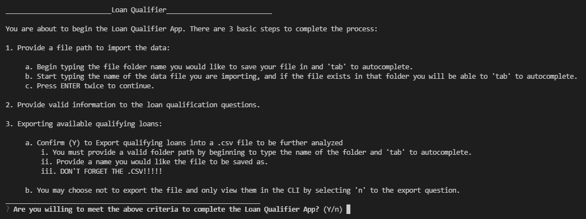

# Loan Qualifier App Export to CSV (LQExport)
---

---

## Loan Qualifier App Export to CSV (LQExport)

Welcome to my repository for the Loan Qualifier App Export to CSV (LQExport). The purpose of this App is to help the user identify potential banks they can use to qualify for a home loan based on basic financial information they input. Once they have identified those banks they will have the option to export the filtered dataset to a csv file, or view the list within the CLI.

---

## Technologies

---

## Installation Guide

---

## Usage with Examples

To use the LQExport application you must have your data saved in a folder path easily accessible and in a .csv format. 

To launch the program simply clone the repository and run app.py
`python app.py

You will be greated with a new set of initial directions to refresh the users memory of how the application operates. 

Once the user has read and accepted the instructions the app will ask for a file path to the csv file that holds the bank information the user would like to filter. 

As shown in the clip above: When inputing your file path just begin typing the name of the folder ("da") and you should notice a 'data' autocomplete request under the letters. If this is the correct folder you can hit TAB to complete the name. Same can be done for the name of the csv file.

**Once you have completed entering in your file path you must hit ENTER twice in order to get to the next level of information inputs.**

The next steps require data entry specific to the questions asked. 

The app will prompt the user of the following information:

*The monthly debt to income ratio*
*The loan to value ratio*
*How many loans they qualify for*

After those statistics the app will ask the user if they would like to "save a copy as a .csv?". 

If the user selects "Y" they will be asked to provide the file path to the folder they would like to save the file in. The path can be found by typing the folder name and an autocomplete prompt should appear below, TAB to autocomplete. Once you have reached the folder you would like to save the CSV file to; name your file with ".csv" at the end. Remember to replace and spaces with an underscore "_" so there won't be any errors. **Again, you will need to ENTER twice to move on.**

If the user select "n" they will receive a second prompt asking if they would like to view the list of loans in the CLI. 

*If they select "Y" a list will appear within the CLI and the system will exit.*

*If they select "n" the program will tell them to have a nice day and exit.*

---

## Contributors

Brought to you by Rice FinTech Boot Camp students

---

## License

MIT License

---
